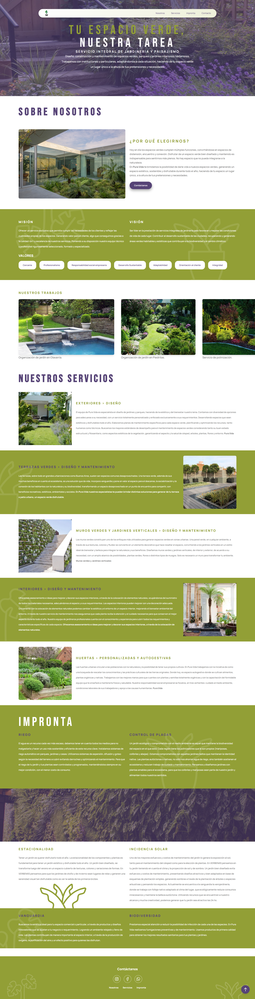

# Pura Vida 🌱

Sitio web oficial de **Pura Vida Huertas**, una huerta agroecológica dedicada a la producción sostenible, el cuidado del suelo y la alimentación consciente.  

Este es un proyecto desarrollado utilizando **Astro** como framework principal, **Tailwind CSS** para los estilos y la librería **Swiper** para implementar un carrusel interactivo.

## Frameworks y librerias usadas para el proyecto

- **Astro**: Framework moderno para construir sitios web rápidos, optimizados y fáciles de mantener.
- **Tailwind CSS**: Framework de utilidades para diseñar interfaces con facilidad y flexibilidad.
- **Swiper**: Librería para crear carruseles fluidos y personalizables.

## 📸 Vista previa

  

  Interfaz principal de la aplicación

